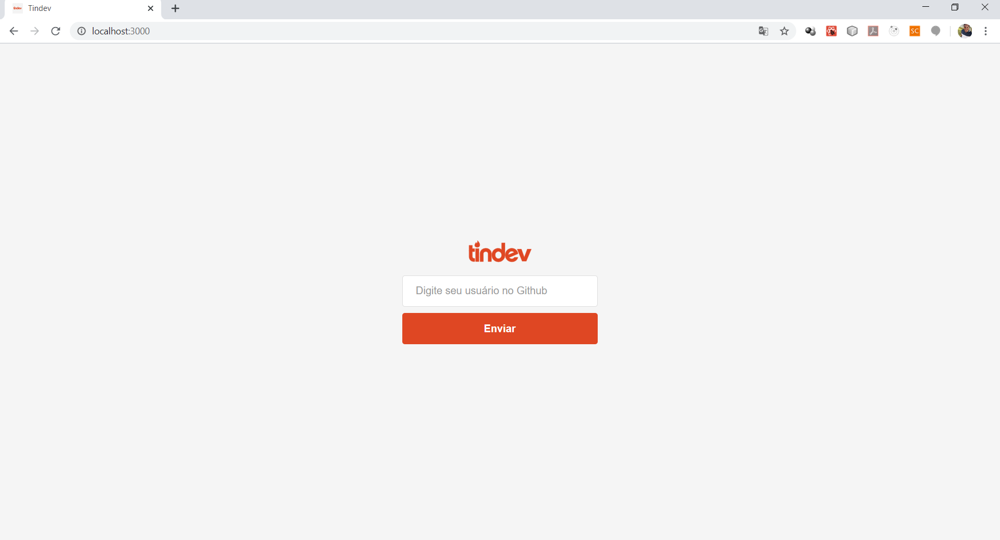
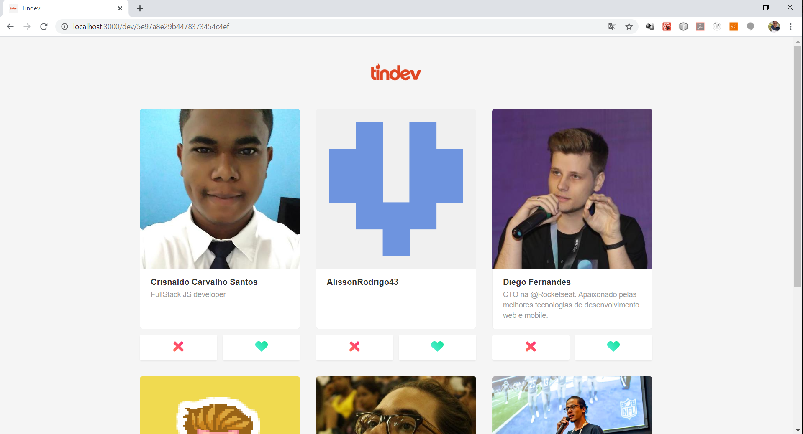
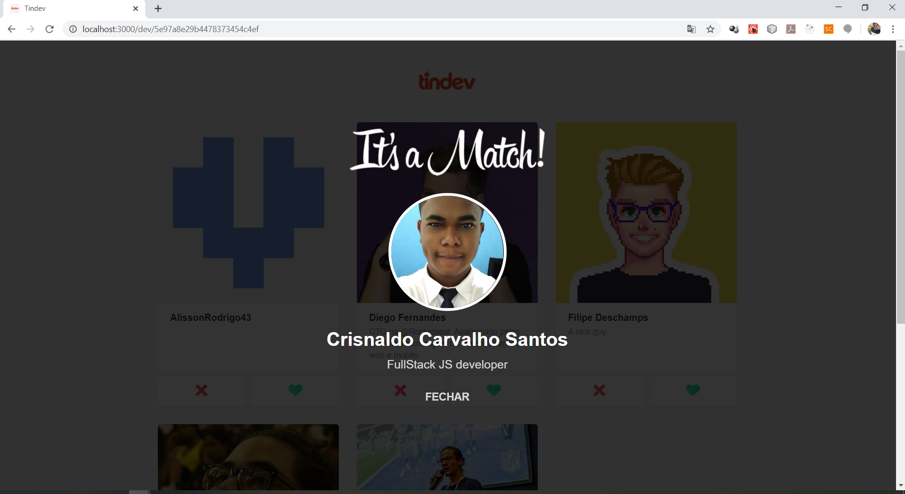
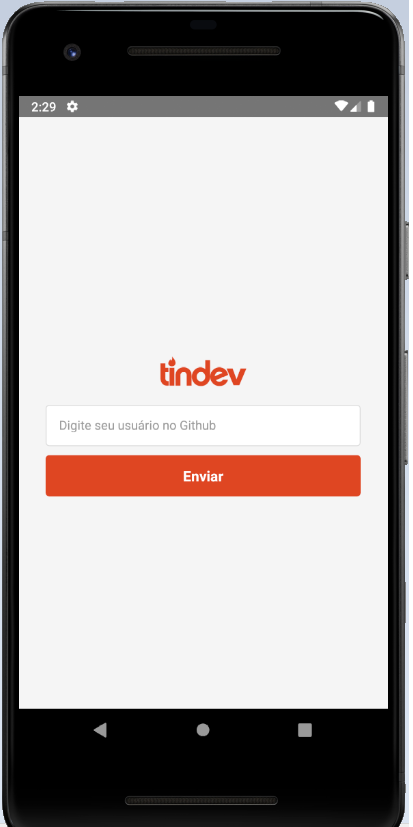
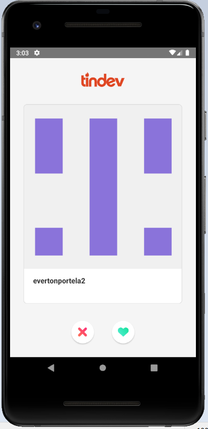
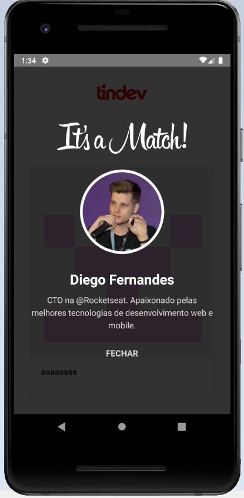

# Semana OminiStack 8

<h5 align="center">
    
</h5>

Tindev, aplicação desenvolvida durante a semana OmniStack 8 realizada pela Rocketseat. Com melhorias realizadas no tratamento de erros e responsividade.

## Descrição:

 Tomando por inspiração o Tinder, a aplicação provê um Tinder para desenvolvedores, onde o registro é feito através do usuário do Github, é possível dar likes e deslikes nos desenvolvedores registrados, e em caso de match ambos os desenvolvedores são notificados em tempo real! 

### Tenologias:
- NodeJS com Express
- React JS
- React Native
- Socket IO
- MongoDB

## Screenshots:

### Versão Web:

Tela de login:

Tela Home:

Feedback Match:

### Versão Mobile:

Tela de login:

Tela Home:

Feedback Match:

